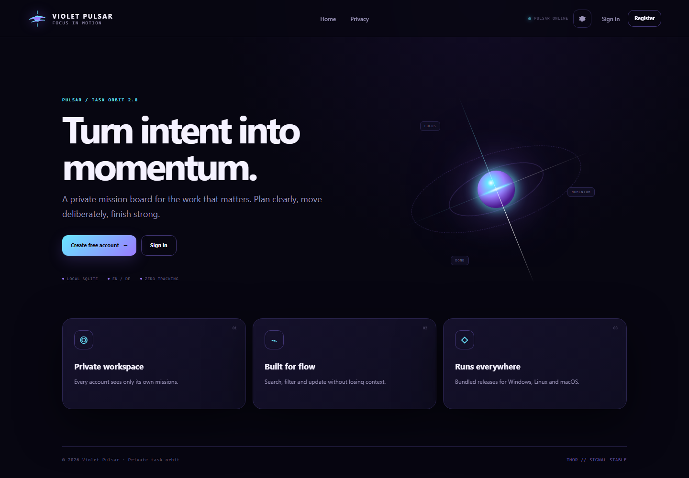

# Violet Pulsar · Task Orbit

<p align="center">
  
</p>

<p align="center">
  <strong>A private bilingual mission board built with ASP.NET Core.</strong>
</p>

<p align="center">
  <a href="https://github.com/sofoste93/CSHARP/releases/latest"><strong>Download Violet Pulsar</strong></a>
  ·
  <a href="#features">Features</a>
  ·
  <a href="#data-and-privacy">Data</a>
</p>



## From task list to mission control

Violet Pulsar 2.0 rebuilds the original C# task manager as a focused, cross-platform workspace. The application runs locally, opens in your browser and isolates every mission by user account.

## Features

- Secure account registration and sign-in with ASP.NET Core Identity
- English and German interface with a persistent language selector
- Search, open/completed/overdue filters and flexible sorting
- Four priority levels and optional due dates
- Quick completion and one-click mission recall
- Dashboard metrics with live task status
- Deep-space, starlight and system themes
- Compact layout and reduced-motion settings
- Automatic SQLite schema migrations on startup
- Local-only storage with no advertising, tracking or cloud dependency
- Self-contained Windows, Linux and macOS releases

## Install

Download the archive for your system from [GitHub Releases](https://github.com/sofoste93/CSHARP/releases/latest). The .NET runtime is included.

| System | Download | Launch |
|---|---|---|
| Windows 10/11 x64 | `Violet-Pulsar-Windows-x64.zip` | `VioletPulsar.exe` |
| Linux x64 | `Violet-Pulsar-Linux-x64.tar.gz` | `./VioletPulsar` |
| macOS Intel | `Violet-Pulsar-macOS-x64.tar.gz` | `./VioletPulsar` |
| macOS Apple Silicon | `Violet-Pulsar-macOS-arm64.tar.gz` | `./VioletPulsar` |

Extract the archive and launch the executable. Violet Pulsar starts a loopback-only web server at `http://127.0.0.1:5274` and opens the default browser. Stop the application by closing its terminal window or pressing `Ctrl+C`.

macOS may require **Control-click → Open** for the first launch. Windows can show a SmartScreen warning until a publicly trusted Authenticode certificate is configured; the release workflow is signing-ready through [SIGNING.md](SIGNING.md).

## Data and privacy

The SQLite database is stored outside the application directory:

| System | Data directory |
|---|---|
| Windows | `%LOCALAPPDATA%\Violet Pulsar` |
| macOS | `~/Library/Application Support/Violet Pulsar` |
| Linux | `$XDG_DATA_HOME/violet-pulsar` or `~/.local/share/violet-pulsar` |

Set `VIOLET_PULSAR_DATA_DIR` to choose another directory. Existing users can migrate by placing the old `TaskManagerApp.db` beside the executable before the first launch; Violet Pulsar detects, copies and upgrades it automatically.

The server listens only on the local device by default. Account and task records never leave the SQLite database, and the application contains no telemetry or third-party runtime resources.

## Development

Requirements: .NET SDK 9.0 or newer.

```bash
dotnet restore
dotnet build CSHARP.sln --configuration Release
dotnet run --project TaskManagerApp/TaskManagerApp
```

Run the isolated database and migration health check:

```bash
dotnet run --project TaskManagerApp/TaskManagerApp -- --diagnostics
```

Create a self-contained app:

```powershell
powershell -ExecutionPolicy Bypass -File scripts/package.ps1 -Runtime win-x64
```

```bash
bash scripts/package.sh linux-x64
```

## License

Copyright © 2026 Stephane Sob Fouodji. Released under the [MIT License](LICENSE).

**THOR // violet pulse synchronized.** 🟣🛰️
